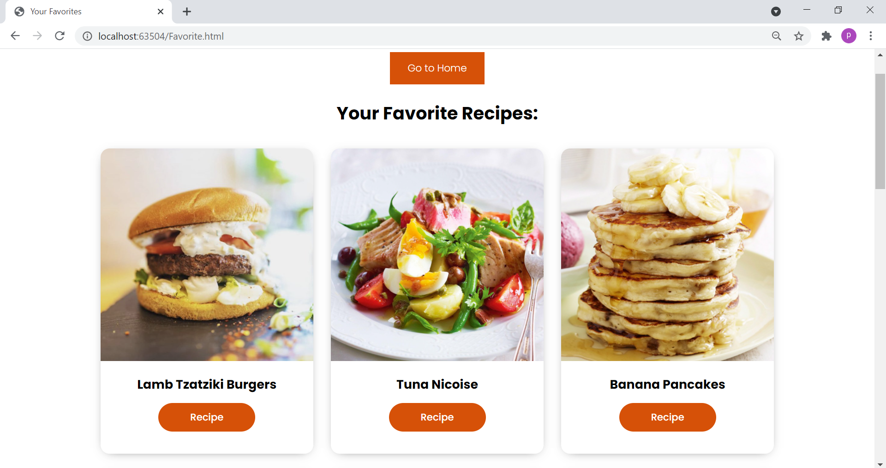

# The-Meal-App
This Website is designed as an assignment for IDT summer internship.

-> API used to get database is: https://www.themealdb.com/api.php (It's an open database!) 
-> Below are the functionalities website have: (i) Search by Name (ii) Search by Ingredient (iii) Search by Category

-> You can add recipe in your Favorite list by just one click on heart button. It will turn from empty to red! 
   Same way you can Remove recipe from the Favorite list by ciclking again on that. Heart button will turn empty from red!

-> Wanna see your Favorites? Just click on the Favorite Recipes button!

-> Favorite Recipes' ids are stored in local storage in JSON format.

-> BONUS: Number of times recipe get searched is also stored in local storage in JSON formate by using Dictionary. 
   Where key is the Name get searched and value is integer. Value will increment by number of times it will search in the future.

-> To see those in local storage press F12. Then go to Application. And in the Application Local sotrage will have: 
   (1) LIKE : for Favorite Recipe id Array and (2) ITEMCOUNT: for key value pair dictionary of recipe got searched.

**SCREENSHOTS**

**(1) Index.html**

**(2) Search Result**

**(3) Receipe Instruction**

**(4) Favorite Receipe List**

**(5) Internal Storage Structure**

